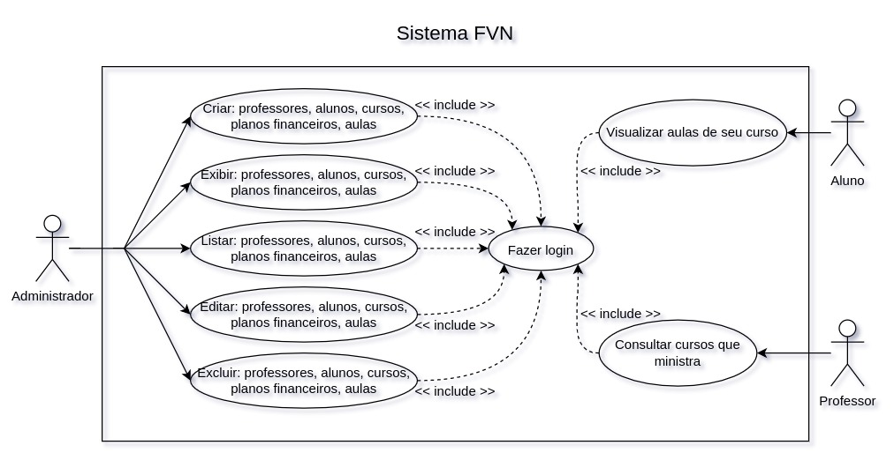

# Projeto Faculdade Vila Nova
O projeto disponibiliza um sistema web com api integrada

# Link com as requests e responses do postman e o banco .sql
https://drive.google.com/drive/folders/1EYmYG1sdVwT72dFOkvntHpR-SAGdEf0g?usp=sharing

# Endpoints
+ Listagem de professores
+ Listagem de alunos por curso
+ Listagem aulas por curso
+ Cursos disponíveis
+ Cursos indisponiveis
+ Filtragem de resultados por campos nas consultas principais
+ Aulas do aluno + valor da mensalidade com desconto

# Diagrama de Casos de Uso


### Autenticação
Basic auth 

### Endpoint listagem de professores
GET Listar Professores <br />
```api/professores```

RESPONSE 
```JSON
{
    "data": [
        {
            "id": 1,
            "nome": "Nicolette Beahan",
            "matricula": "221",
            "cpf": "81111093293",
            "competencia": "Alda Friesen",
            "escolaridade": "Prof. Dagmar Tillman",
            "created_at": "2021-12-31T05:16:04.000000Z",
            "updated_at": "2021-12-31T05:16:04.000000Z"
        },
        {
            "id": 2,
            "nome": "Ms. Joana Mitchell",
            "matricula": "935",
            "cpf": "65905678399",
            "competencia": "Wilford Schumm V",
            "escolaridade": "Jerod Deckow",
            "created_at": "2021-12-31T05:16:04.000000Z",
            "updated_at": "2021-12-31T05:16:04.000000Z"
        }
    ],
    "links": {
        "first": "http://localhost:8000/api/professores?page=1",
        "last": "http://localhost:8000/api/professores?page=2",
        "prev": null,
        "next": "http://localhost:8000/api/professores?page=2"
    },
    "meta": {
        "current_page": 1,
        "from": 1,
        "last_page": 2,
        "links": [
            {
                "url": null,
                "label": "&laquo; Previous",
                "active": false
            },
            {
                "url": "http://localhost:8000/api/professores?page=1",
                "label": "1",
                "active": true
            },
            {
                "url": "http://localhost:8000/api/professores?page=2",
                "label": "2",
                "active": false
            },
            {
                "url": "http://localhost:8000/api/professores?page=2",
                "label": "Next &raquo;",
                "active": false
            }
        ],
        "path": "http://localhost:8000/api/professores",
        "per_page": 8,
        "to": 8,
        "total": 10
    },
    "informação importante": "Essa API não está em produção, é apenas de homologação e testes"
}
```

### Endpoint listagem de alunos por curso
GET Listar alunos por curso <br />
```api/alunos/{idcurso}```

RESPONSE
```JSON
{
    "data": [
        {
            "id": 1,
            "nome": "Guy Will",
            "matricula": "597",
            "datanascimento": "1988-03-19",
            "idade": "23",
            "responsavelFinanceiro": "Bernadine Senger Jr.",
            "cpf": "69995875899",
            "idcursos": 1,
            "idplano": 2,
            "created_at": "2021-12-31T05:16:04.000000Z",
            "updated_at": "2021-12-31T05:16:04.000000Z"
        },
        {
            "id": 4,
            "nome": "Vanessa Gorczany",
            "matricula": "564",
            "datanascimento": "1975-12-05",
            "idade": "87",
            "responsavelFinanceiro": "Abner Kiehn",
            "cpf": "56669501009",
            "idcursos": 1,
            "idplano": 2,
            "created_at": "2021-12-31T05:16:04.000000Z",
            "updated_at": "2021-12-31T05:16:04.000000Z"
        },
        {
            "id": 6,
            "nome": "Hassan Roob",
            "matricula": "40",
            "datanascimento": "1978-03-22",
            "idade": "35",
            "responsavelFinanceiro": "Demarco Bergstrom MD",
            "cpf": "45726563584",
            "idcursos": 1,
            "idplano": 2,
            "created_at": "2021-12-31T05:16:04.000000Z",
            "updated_at": "2021-12-31T05:16:04.000000Z"
        },
        {
            "id": 8,
            "nome": "Dr. Norwood Quigley III",
            "matricula": "887",
            "datanascimento": "1976-07-29",
            "idade": "93",
            "responsavelFinanceiro": "Howell Wilkinson",
            "cpf": "34348051060",
            "idcursos": 1,
            "idplano": 2,
            "created_at": "2021-12-31T05:16:04.000000Z",
            "updated_at": "2021-12-31T05:16:04.000000Z"
        }
    ],
    "informação importante": "Essa API não está em produção, é apenas de homologação e testes"
}
```

### Endpoint listagem de aulas por curso
GET Listar aulas por curso <br />
```api/aulas/{idcurso}```

RESPONSE
```JSON
{
    "data": [
        {
            "id": 1,
            "num_aula": 30,
            "tema": "Jammie Funk",
            "duracao": "80",
            "observacao": "Aliquam exercitationem iste eaque sint non. Voluptatibus et quo et laborum voluptatem. Tempore nihil excepturi debitis saepe pariatur.",
            "idcurso": 1,
            "idprofessor": 3,
            "created_at": "2021-12-31T05:16:05.000000Z",
            "updated_at": "2021-12-31T05:16:05.000000Z"
        },
        {
            "id": 11,
            "num_aula": 61,
            "tema": "Prof. Sam Macejkovic",
            "duracao": "37",
            "observacao": "Eius sit distinctio aut ratione eum expedita voluptatem voluptates. Corporis nemo et exercitationem.",
            "idcurso": 1,
            "idprofessor": 10,
            "created_at": "2021-12-31T05:16:05.000000Z",
            "updated_at": "2021-12-31T05:16:05.000000Z"
        },
        {
            "id": 16,
            "num_aula": 26,
            "tema": "Arjun Goyette",
            "duracao": "99",
            "observacao": "Aspernatur et aut aut sint mollitia. Vitae quia nihil deleniti qui doloremque eos aut. Sed consequatur quis voluptatem tenetur.",
            "idcurso": 1,
            "idprofessor": 5,
            "created_at": "2021-12-31T05:16:05.000000Z",
            "updated_at": "2021-12-31T05:16:05.000000Z"
        }
    ],
    "informação importante": "Essa API não está em produção, é apenas de homologação e testes"
}
```

### Endpoint listagem de cursos disponíveis
GET Listar cursos disponíveis <br />
```api/cursos/disponiveis```

RESPONSE
```JSON
{
    "data": [
        {
            "id": 1,
            "nomedocurso": "Willy Hane",
            "qntmax": 8,
            "descricao": "Consectetur porro debitis placeat sed necessitatibus eveniet nesciunt. Ipsum itaque autem doloribus perspiciatis. Incidunt eveniet eum libero similique.",
            "datacriacao": "2007-01-14T08:47:46.000000Z",
            "dataupdate": "1974-06-16T01:13:13.000000Z",
            "categoria": "repellat",
            "mensalidade": 2235.02,
            "status": "Disponível"
        },
        {
            "id": 4,
            "nomedocurso": "Cassandre Kuhn V",
            "qntmax": 8,
            "descricao": "Labore inventore doloribus amet est voluptas expedita. Vel ea voluptates excepturi. Harum ut dolores est sunt assumenda et. Voluptatem eum sunt maiores ab ut.",
            "datacriacao": "1973-11-05T17:21:18.000000Z",
            "dataupdate": "2020-05-18T22:11:51.000000Z",
            "categoria": "nihil",
            "mensalidade": 2395.38,
            "status": "Disponível"
        },
        {
            "id": 6,
            "nomedocurso": "Mrs. Alexa McClure",
            "qntmax": 7,
            "descricao": "Minus libero voluptas sunt est impedit autem. Quidem inventore quo aut eum. Aut voluptas facere reiciendis non eos doloremque.",
            "datacriacao": "2016-08-23T01:04:01.000000Z",
            "dataupdate": "2016-01-26T13:03:38.000000Z",
            "categoria": "vitae",
            "mensalidade": 9593.85,
            "status": "Disponível"
        },
        {
            "id": 7,
            "nomedocurso": "Lindsey Yost",
            "qntmax": 6,
            "descricao": "Eveniet sed quo et aspernatur ipsam enim nulla et. Voluptas debitis rerum labore voluptas. Similique aut aliquid esse enim. Et dolorem facere rerum voluptate fuga rerum ullam.",
            "datacriacao": "1993-11-24T22:06:20.000000Z",
            "dataupdate": "1991-03-05T00:29:15.000000Z",
            "categoria": "atque",
            "mensalidade": 3112.47,
            "status": "Disponível"
        }
    ],
    "informacao": "Essa API não está em produção, é apenas de homologação e testes"
}
```


### Endpoint listagem de cursos indisponiveis
GET Listar cursos indisponiveis <br />
```api/cursos/indisponiveis```

RESPONSE
```JSON
{
    "data": [
        {
            "id": 2,
            "nomedocurso": "Teresa Lebsack",
            "qntmax": 2,
            "descricao": "Fugit veniam totam occaecati et non. Atque vero voluptates quam blanditiis amet maxime dolore. Voluptatem est ut iusto qui quibusdam asperiores.",
            "datacriacao": "1989-01-17T20:34:57.000000Z",
            "dataupdate": "2000-12-07T01:35:31.000000Z",
            "categoria": "atque",
            "mensalidade": 917.86,
            "status": "Indisponível"
        },
        {
            "id": 3,
            "nomedocurso": "Merritt Rosenbaum V",
            "qntmax": 2,
            "descricao": "Qui nemo quia laborum et ut placeat. Quasi voluptas officia doloribus adipisci omnis laudantium occaecati rerum. Voluptas velit aut nihil vitae commodi odio.",
            "datacriacao": "1972-05-03T18:17:43.000000Z",
            "dataupdate": "1992-02-11T04:54:22.000000Z",
            "categoria": "voluptas",
            "mensalidade": 5457.61,
            "status": "Indisponível"
        },
        {
            "id": 5,
            "nomedocurso": "Mr. Ryan Ryan III",
            "qntmax": 4,
            "descricao": "Et aut non repudiandae et. Consequuntur eos qui molestiae est sit ut et.",
            "datacriacao": "2009-11-01T16:20:24.000000Z",
            "dataupdate": "1988-08-11T18:44:07.000000Z",
            "categoria": "vitae",
            "mensalidade": 4189.54,
            "status": "Indisponível"
        },
        {
            "id": 8,
            "nomedocurso": "Prof. Ernesto Reinger DDS",
            "qntmax": 1,
            "descricao": "Corporis similique aut dolor et ut. Voluptatem commodi laboriosam aut ea et blanditiis. Ab facere sit sint facere. Ea quas minus atque qui.",
            "datacriacao": "1972-06-29T09:20:39.000000Z",
            "dataupdate": "1988-08-26T09:36:51.000000Z",
            "categoria": "nam",
            "mensalidade": 8457.11,
            "status": "Indisponível"
        }
    ],
    "informacao": "Essa API não está em produção, é apenas de homologação e testes"
}
```

